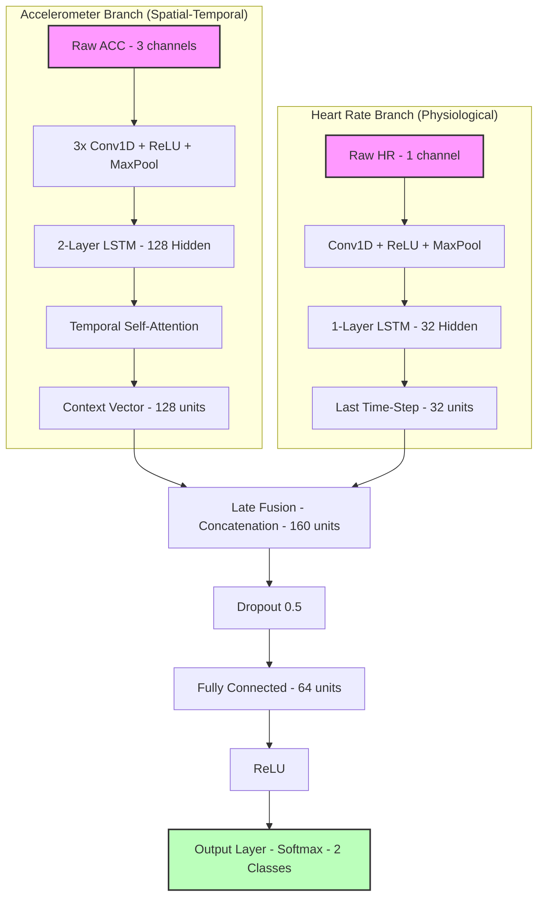
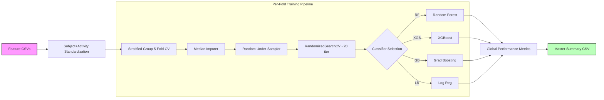

# CareWear Study Data Processing

Pre requisite:
-- Data access
1. Concat_File/
2. merged_lables/

## Visualizer
Run following:

visualizer_dash_raw.py

Plots dasboard for entire dataset Smartwatch (HR), Belt (ECG, Respiration)

```bash
pip install -r requirements.txt
python3 visualizer_dash_raw.py
```

---

## Machine Learning & Deep Learning Pipelines

This repository contains two primary pipelines for stress detection using wearable data: a traditional Machine Learning (ML) benchmarking tool and a Deep Learning (DL) Fusion network.

### 1. Deep Fusion Network with Attention
**File:** `machine_learning/dl_run_stratified_5fold_fusion_attention_auto.py`

This script implements a multimodal Deep Learning architecture that fuses Accelerometer (ACC) and Heart Rate (HR) data using a combination of CNNs, LSTMs, and Temporal Attention.

#### Model Architecture
The `DeepFusionNet` architecture follows a late-fusion approach:



#### Evaluation Pipeline
- **Cross-Validation:** 5-Fold Stratified Group K-Fold (ensures no data leakage between participants).
- **Windowing:** Defaults to 60-second sliding windows with 50% overlap.
- **Normalization:** Subject-wise Z-score standardization.
- **Training:** Uses AdamW optimizer, `ReduceLROnPlateau` scheduler, and early stopping.
- **Outputs:** Confusion matrices, gradient flow logs, and probability distribution plots per fold.

---

### 2. Automated ML Benchmarking
**File:** `machine_learning/run_stratified_5fold_auto.py`

This script provides an automated framework to benchmark traditional ML classifiers across multiple scientific feature sets.

#### ML Pipeline Structure
The pipeline uses `imblearn` and `sklearn` to handle class imbalance and hyperparameter optimization.



#### Evaluation Pipeline
- **Feature Sets:** Automatically benchmarks sets including Time Domain Stats, HRV Proxies, ACC Kinematics, and Spectral Band Power.
- **Balancing:** Implements a "mild under-sampling" strategy to handle class imbalance while preserving data.
- **Hyperparameters:** Conducts `RandomizedSearchCV` on a pre-defined grid for each fold.
- **Metrics:** Calculates Accuracy, Balanced Accuracy, F1-Score, Sensitivity, Specificity, and ROC-AUC.
- **Deployment:** After validation, trains a final model on the full dataset and saves it as a `.pkl` file.